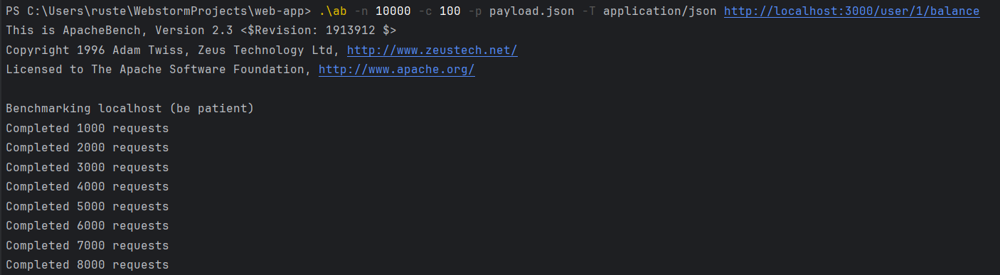
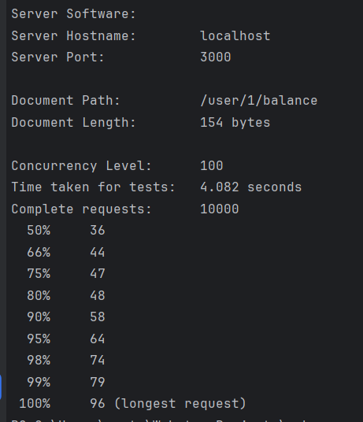

# 1. Запуск миграции:
Параметры для подключения к бд ./models/index.js
```bash
$ npm i
$ npm run migrate
```
# 2. Запуск сервера:
```bash
$ npm i
$ npm run start
```
# Было проведено тестирование:
Для тестирования использовался Apache Benchmark:
```bash
$ .\ab -n 10000 -c 100 -p payload.json -T application/json http://localhost:3000/user/1/balance
```



